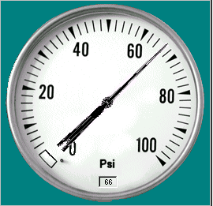

<div align="center">

## OCX Gauge


</div>

### Description

Here is my first submission since a "hacker" erased all the things of my repertoire.

Il s'agit d'un contrôle.It is a gauge showing pressure in psi having as value source in kPa.

(Because we use metric values at my work and because i still love imperial system) i made that Old Style Gauge.I tempted several manners to arrive at my purposes (almost the end), in the first place, a simple line for the needle, it did not seem real, then I had to draw a needle in three fragments to make her the smallest as possible and by using the method of

SetPixel and GetPixel. The only problem is that there is a refreshment in every consequentive change...Test it and why not try to improve it...

All the constructive messages are welcome.
 
### More Info
 


<span>             |<span>
---                |---
**Submitted On**   |2002-06-04 19:23:34
**By**             |[Les Productions UnderDog](https://github.com/Planet-Source-Code/PSCIndex/blob/master/ByAuthor/les-productions-underdog.md)
**Level**          |Advanced
**User Rating**    |4.8 (38 globes from 8 users)
**Compatibility**  |VB 4\.0 \(32\-bit\), VB 5\.0, VB 6\.0
**Category**       |[Custom Controls/ Forms/  Menus](https://github.com/Planet-Source-Code/PSCIndex/blob/master/ByCategory/custom-controls-forms-menus__1-4.md)
**World**          |[Visual Basic](https://github.com/Planet-Source-Code/PSCIndex/blob/master/ByWorld/visual-basic.md)
**Archive File**   |[OCX\_Gauge90303642002\.zip](https://github.com/Planet-Source-Code/les-productions-underdog-ocx-gauge__1-35478/archive/master.zip)

### API Declarations

```
Private Declare Function SetPixel Lib "gdi32" (ByVal hdc As Long, ByVal x As Long, ByVal y As Long, ByVal crColor As Long) As Long
Private Declare Function GetPixel Lib "gdi32" (ByVal hdc As Long, ByVal x As Long, ByVal y As Long) As Long
```


